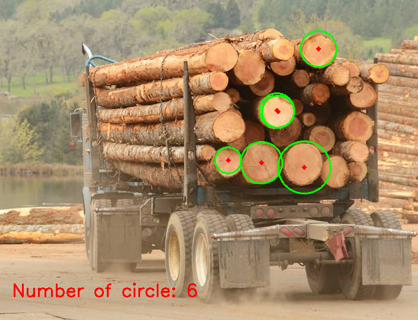

## Overview
this is application to detect circle on log (wood) and detect rectangle iron on wood truck

## features
- load image
- detect circle on log (wood)
- be able to know number of circle of wood log

## current problem
- can not detect the rectangle iron on wood truck
- the less number of circle detected

## improvement or suggestion
- to be better result can implement object detection for circle of surface of wood log and rectangle iron which is not be able to do in short time currently

## how to run
1. make sure python is installed.
2. make sure library for `fire`, `opencv`, `numpy` are installed too
3. please clone the repo
4. run `python main.py run --image <image.png>`

## the current result

